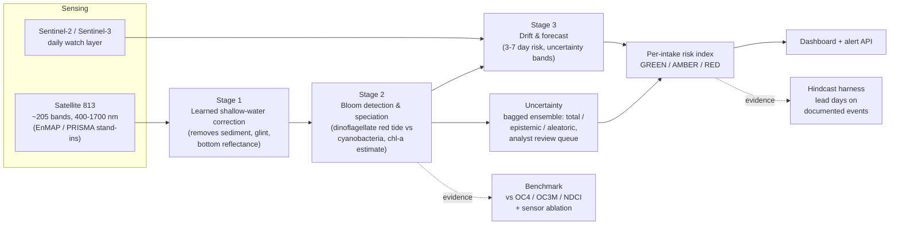

# MARSAD 813 - Hyperspectral Harmful-Algal-Bloom Early Warning

**An AI early-warning service that converts hyperspectral satellite spectra into bloom
alerts and 3-7 day risk forecasts for UAE desalination intakes and inland water
reserves, engineered for the shallow, turbid Gulf water where standard satellite
algorithms fail.**

Working name **MARSAD** (مَرصَد, Arabic for *watchpost / observatory*): a fixed
lookout that watches the water so operators do not learn about a bloom when cells
reach the intake screens. Built for the **Arab 813 Space Hackathon 2026**,
Theme 4 (Water Quality & Inland/Coastal Water Intelligence), Hyperspectral Data
Track (Satellite 813, 100+ bands).

**Version 0.2.** v0.1 delivered the three-stage pipeline on physics-based
synthetic Gulf spectra. v0.2 adds the *evidence layer*: a head-to-head benchmark
against the published algorithms an operator runs today, a sensor ablation that
tests whether hyperspectral is the enabling sensor or a passenger, per-prediction
uncertainty, an event hindcast harness, and a read-only alert API. Every number
below was measured by running the code in this repo, and every number comes from
our own forward model rather than from real water. That distinction is spelled out
in full under [What this is, and what it is not](#what-this-is-and-what-it-is-not).

## Why Gulf water breaks standard algorithms

The Arabian Gulf is the most desalination-dependent sea on Earth, and its water is
exactly where off-the-shelf satellite water-quality monitoring fails: it is shallow,
turbid, and hypersaline. Simple band-ratio chlorophyll algorithms tuned for open
ocean give garbage here because the algae pigment signal is mixed with sediment
backscatter, sunglint, and, in shallow coastal pixels, reflectance from the sea
bottom itself. Broad-band sensors cannot separate these effects, and most of them
do not sample diagnostic pigments such as phycocyanin (~620 nm, the toxic
cyanobacteria marker) at all. The stakes are national: desalination provides most
UAE potable water, stored supply covers roughly a day or two of demand, the
2008-2009 *Cochlodinium* bloom forced plant shutdowns, and losses during red-tide
events run over Dh368,000/day. Oman launched a bloom-prediction model in 2024; the
UAE-side gap is open. Solving that specific failure with a learned shallow-water
correction is the core of this project, not a generic bloom demo.

## Does it actually work?

Reproduce everything in this section with one command (about 50 s on a laptop):

```bash
".venv/Scripts/python" scripts/run_benchmark.py
```

**1. Speciation in the regime the whole project targets.** In shallow turbid water
(depth < 10 m and TSS >= 8 g/m3), the classical operator decision tree (NDCI
chlorophyll threshold, then 620 nm phycocyanin line height) scores **0.474**
accuracy over {no_bloom, dinoflagellate, cyanobacteria}. MARSAD Stage 1 + Stage 2
scores **0.993** on the same pixels: a gain of **+0.520**.

**2. Chlorophyll retrieval degrades exactly where the intakes are.** Median
absolute log10 error, so 0.30 means typically a factor of 2 out and 1.00 means an
order of magnitude. Baselines run on the raw observed spectra, because raw
radiometry is what an operator actually holds; MARSAD runs on Stage-1-corrected
spectra, because that is what MARSAD holds.

| Water regime | n | OC4 | OC3M | NDCI | MARSAD | best baseline / MARSAD |
|---|---:|---:|---:|---:|---:|---:|
| Optically deep | 670 | 0.530 | 0.491 | 1.069 | **0.036** | 13.7x |
| Shallow, clear | 1172 | 0.982 | 1.025 | 0.390 | **0.029** | 13.5x |
| Deep, turbid | 60 | 0.610 | 0.601 | 0.654 | **0.037** | 16.3x |
| Shallow + turbid | 152 | 0.706 | 0.769 | 0.621 | **0.041** | 15.0x |

OC4, the open-ocean workhorse, degrades from 0.530 in optically deep water to
0.706 in shallow turbid water and 0.982 in shallow clear water: a bright sandy
bottom moves the blue-green band ratio without any change in chlorophyll. MARSAD
stays between 0.029 and 0.041 across all four regimes, 15x better than the best
baseline on the shallow turbid pixels.

**3. Hyperspectral is the enabling sensor, and the reason is one band.** The same
Stage 1 + Stage 2 architecture is retrained from scratch on spectra resampled to
each sensor's real band set and lifted back to 205 inputs, so only the spectral
*information* changes, never the model input width.

| Sensor | bands | accuracy | cyanobacteria recall |
|---|---:|---:|---:|
| MARSAD 813 imaging spectrometer | 205 | **0.960** | **0.929** |
| Sentinel-3 OLCI | 17 | 0.955 | 0.912 |
| MODIS Aqua | 15 | 0.886 | 0.804 |
| Landsat-8 OLI | 6 | 0.815 | 0.657 |
| Sentinel-2 MSI | 12 | 0.803 | 0.619 |

Read that table honestly. The headline `hyperspectral_gain` (813 minus the best
multispectral alternative) is only **+0.005**, because Sentinel-3 OLCI is the one
operational ocean-colour sensor that carries a 620 nm band, and in our forward
model it recovers most of the phycocyanin signal. The large and robust collapse is
against every sensor with **no** 620 nm band: against the best of those (MODIS
Aqua) the 813 grid gains **+0.073 accuracy and +0.124 cyanobacteria recall**.
Overstating the OLCI margin would be the easiest way to lose a judge, so the
benchmark prints the per-sensor capability notes next to every accuracy.

**4. The pipeline end to end.** `scripts/run_demo.py` (seed 7, 4000 training
pixels, 1200 scene pixels, about 36 s) reports Stage 1 spectral RMSE
**0.00480 -> 0.00020** on holdout, a 95.8% reduction, Stage 2 holdout accuracy
**0.973**, and a four-asset alert feed (2 RED, 1 AMBER, 1 GREEN in that run) with
per-prediction uncertainty attached to every monitored asset.

**5. Lead time, the metric an operator actually buys.** The hindcast harness
(`marsad.hindcast`, seed 5) replays a bloom timeline shaped to the documented
2008-2009 *Cochlodinium polykrikoides* event on the UAE east coast (Richlen et al.
2010, Harmful Algae 9(2), 163-172) and scores the alert sequence: first AMBER and
first RED both on **day -19**, so **19 days of warning** before the reported impact
date, with **0 false-alarm days** while the water was still clear. The illustrative
inland cyanobacteria case gives 16 days.

### What this is, and what it is not

`src/marsad/synth.py` is **our own physics-based forward model** of Gulf Case-2
water. Every figure above is therefore a **self-consistency check against a
simulation**, consistent with the Case-2 water literature on band-ratio failure in
optically complex water, and **never independent validation** of how any algorithm
behaves on a real Gulf scene. We have not proved that standard algorithms fail on
real Gulf water. We have measured that they fail on a simulation built from the
published optics of that water.

Real validation is the **hindcast on documented events using archived scenes**:
replace `hindcast.simulate_event_timeseries` with Sentinel-3 OLCI / Sentinel-2 MSI
imagery over the documented dates and coordinates (EnMAP / PACE for present-day
hyperspectral coverage, GLORIA in-situ matchups for the water-leaving reference)
and rerun `run_hindcast` unchanged. The module is structured for exactly that
swap. It is on the roadmap for September and it is **not done yet**. This rule is
binding on every module docstring, printed line and dashboard string in the repo
(see [`docs/CONTRACTS-V2.md`](docs/CONTRACTS-V2.md)).

## Architecture



1. **Stage 1 - Shallow-water spectral correction (the novel core).** A learned
   correction that strips sunglint, sediment, and bottom-reflectance effects from
   coastal spectra. Residual formulation (the MLP regresses the contamination, not
   the clean spectrum) so narrow pigment lines such as the 620 nm phycocyanin dip
   survive the correction instead of being repainted with their conditional mean.
2. **Stage 2 - Bloom detection & speciation.** A spectral classifier over the band
   dimension separating no-bloom, dinoflagellate red tide (*Karenia*,
   *Cochlodinium*) near intakes, and toxic cyanobacteria (phycocyanin ~620 nm) in
   inland reservoirs, plus a chlorophyll-a intensity estimate.
3. **Stage 3 - Drift & forecast.** Fuses the daily Sentinel watch layer with sparse
   hyperspectral scenes to produce per-intake risk indices with 3-7 day lead time
   and explicit uncertainty bands. Honest architecture: 813's swath and revisit
   cannot monitor alone, so fusion is the design and not a workaround.

v0.2 wraps that pipeline in the modules that make the claim falsifiable:

- **`sensors.py` - multispectral simulation and resampling.** Published band tables
  (centre and FWHM) for Sentinel-2 MSI, Sentinel-3 OLCI, MODIS Aqua and Landsat-8
  OLI, with Gaussian spectral-response resampling in both directions. It is the
  ingest path for real archived scenes *and* the machinery behind the ablation.
- **`baselines.py` - the comparison.** OC4, OC3M, NDCI and NDCI-chlorophyll, the
  Gitelson two-band red/NIR ratio, a 620 nm phycocyanin line height, a
  Nechad-style turbidity proxy, and the classical operator decision tree that
  MARSAD Stage 2 has to beat. Literature algorithms, cited in the docstrings, run
  exactly as an operator would run them today.
- **`uncertainty.py` - per-prediction honesty.** A bagged `EnsembleClassifier`
  splitting predictive entropy into epistemic (model ignorance, fixable with more
  data) and aleatoric (irreducible ambiguity), normalised to [0, 1], plus expected
  calibration error, a reliability curve, and a `review_queue` that routes
  uncertain pixels to a human analyst instead of auto-alerting them.
- **`benchmark.py` - the experiment.** Water-regime classification (optically deep
  / shallow clear / turbid deep / shallow turbid), chlorophyll retrieval error and
  speciation accuracy per regime, and the sensor ablation.
- **`hindcast.py` - the validation harness.** Citable `BloomEvent` records (the
  2008-2009 Gulf of Oman *Cochlodinium* event, plus one clearly flagged
  ILLUSTRATIVE inland cyanobacteria case), simulated daily event timelines, and
  lead-time scoring: first amber day, first red day, days of warning, false-alarm
  days.
- **`alerts.py` and `scripts/serve_api.py` - delivery.** One `Alert` per monitored
  asset carrying level, score, bloom class, chlorophyll, lead days to RED, an
  operator-facing one-liner and the full rationale, served as JSON over a
  stdlib-only HTTP API.

Module-level APIs are frozen in [`docs/CONTRACTS.md`](docs/CONTRACTS.md) (v0.1)
and [`docs/CONTRACTS-V2.md`](docs/CONTRACTS-V2.md) (v0.2). The band grid
(205 bands, 400-1700 nm) lives in [`src/marsad/spectra.py`](src/marsad/spectra.py),
the single source of truth, to be swapped for the real 813 band centres when GIQ
publishes them.

## Quickstart

The virtual environment already exists at `.venv` (numpy, scikit-learn, pytest).
Do **not** create or activate anything: call its interpreter directly from the
repo root.

**PowerShell**

```powershell
.venv\Scripts\python.exe scripts\run_demo.py
# then open the dashboard:
Invoke-Item dashboard\index.html
```

**Git Bash**

```bash
".venv/Scripts/python" scripts/run_demo.py
# then open the dashboard:
start dashboard/index.html
```

`run_demo.py` trains the full pipeline plus the uncertainty ensemble on synthetic
Gulf scenes, prints per-intake risk, the alert feed and the model metrics, then
writes `outputs/results.json` and `dashboard/data.js`. The dashboard is fully
self-contained (works from `file://`, no CDN, no external fonts).

| Command | What it does |
|---|---|
| `scripts/run_demo.py` | Full pipeline, dashboard data, alert feed summary (about 36 s) |
| `scripts/run_demo.py --fast` | Small smoke run; writes to `outputs/fast-preview/` and never touches the judge-facing `dashboard/data.js` |
| `scripts/run_demo.py --no-cache` | Cold retrain, ignoring the fitted-model cache under `outputs/model-cache/`. Identical results, only the wall clock differs |
| `scripts/run_benchmark.py` | The three comparison tables and the headline (about 50 s); writes `outputs/benchmark.json` and `dashboard/benchmark.js` |
| `scripts/run_benchmark.py --fast` | Quick smoke run of the same experiment into `outputs/fast-preview/` |
| `scripts/serve_api.py` | Serves the alert API from `outputs/results.json` |
| `scripts/download_gloria.py` | Documented stub for the real GLORIA / PACE ingest (no network call by default) |

Run the tests (146 tests, about 90 s):

```bash
".venv/Scripts/python" -m pytest -q
```

## Alert API

The delivery promise in the PRD is "dashboard + alert API". The API is stdlib
`http.server` only, so a judge can run it with zero installs. Run the pipeline
once, then:

```bash
".venv/Scripts/python" scripts/serve_api.py            # http://127.0.0.1:8813
".venv/Scripts/python" scripts/serve_api.py --port 9000 --results outputs/results.json
```

| Route | Returns |
|---|---|
| `GET /health` | Service status, results freshness, monitored-asset count, route table |
| `GET /v1/alerts` | Alert feed: `generated_utc`, `source`, `data_basis`, `counts` per level, and one record per asset at or above AMBER. `?min_level=RED` narrows it |
| `GET /v1/intakes` | All monitored asset records (risk, bloom probabilities, uncertainty, history, forecast) |
| `GET /v1/intakes/<name>` | One asset, name URL-encoded and matched loosely, so `Khor%20Fakkan`, `khor-fakkan` and `khor_fakkan` all resolve |
| `GET /v1/metrics` | Stage 1 and Stage 2 model metrics, including the confusion matrix |

JSON everywhere, CORS `*` (the dashboard may be opened straight from `file://`), a
JSON body carrying the full route table on 404, and read-only: any non-GET verb
returns 405. Every payload repeats `"data_basis": "synthetic physics-based
simulation"` so no consumer can mistake a demo alert for a real one. The server
binds to localhost and performs no authentication: this is a demonstration
endpoint, not a hardened public service.

## Repository layout

```
marsad-813/
├── README.md                  ← you are here
├── conftest.py                # pytest import-path setup
├── pyproject.toml
├── .github/workflows/ci.yml   # tests on push/PR + the em-dash guard
├── src/marsad/
│   ├── spectra.py             # 813 band grid + diagnostic wavelengths (source of truth)
│   ├── synth.py               # physics-based synthetic Gulf scene generator
│   ├── sensors.py             # v0.2 multispectral band tables + spectral resampling
│   ├── baselines.py           # v0.2 OC4 / OC3M / NDCI / phycocyanin LH / operator tree
│   ├── stage1_correction.py   # learned shallow-water correction (residual MLP)
│   ├── stage2_classifier.py   # bloom detection, speciation, chl-a regression
│   ├── uncertainty.py         # v0.2 bagged ensemble, entropy split, calibration, review queue
│   ├── stage3_forecast.py     # damped-trend forecast with uncertainty bands
│   ├── risk.py                # per-intake GREEN/AMBER/RED policy
│   ├── benchmark.py           # v0.2 baseline comparison + hyperspectral ablation
│   ├── hindcast.py            # v0.2 documented-event lead-time harness
│   ├── alerts.py              # v0.2 alert records + feed payload
│   └── pipeline.py            # end-to-end orchestration, 4 UAE intakes/reservoirs
├── scripts/
│   ├── run_demo.py            # train + evaluate + write dashboard data + alert feed
│   ├── run_benchmark.py       # v0.2 the comparison experiment and its tables
│   ├── serve_api.py           # v0.2 stdlib-only alert API
│   └── download_gloria.py     # documented stub for real GLORIA/PACE ingest
├── dashboard/
│   ├── index.html             # self-contained control-room dashboard
│   ├── data.js                # generated by scripts/run_demo.py
│   └── benchmark.js           # generated by scripts/run_benchmark.py
├── tests/                     # per-module fast, seeded tests (146 total)
├── docs/
│   ├── CONTRACTS.md           # frozen module APIs (v0.1)
│   ├── CONTRACTS-V2.md        # frozen module APIs (v0.2) + the honesty rule
│   ├── ROADMAP.md             # PRD weeks to repo milestones
│   └── ACTION-CHECKLIST.md    # human-only hackathon actions & deadlines
├── data/                      # real datasets land here (still empty)
└── outputs/                   # results.json, benchmark.json, model cache
```

## Continuous integration

[`.github/workflows/ci.yml`](.github/workflows/ci.yml) runs on every push and pull
request: Ubuntu, Python 3.12, `pip install numpy scikit-learn pytest`, `pytest -q`.
A second job fails the build if any tracked file, or any commit message in the push
or pull request, contains an em-dash (U+2014). The repo was scrubbed of them once
and the guard is what keeps it clean.

## Data plan

| Purpose | Source |
|---|---|
| Training (spectra to pigments) | GLORIA in-situ hyperspectral library (open, Nature Sci Data 2023) |
| Pretraining / global ocean colour | NASA PACE OCI (free, hyperspectral, operational since 2024) |
| Regional hyperspectral scenes | 813 via GIQ (Phases 1-3), EnMAP, Tanager; PRISMA archive |
| Daily watch layer | Sentinel-2 MSI, Sentinel-3 OLCI (free; band tables already in `sensors.py`) |
| Ground truth / events | MOCCAE red-tide monitoring records, published 2008-2009 Gulf of Oman bloom studies, EAD coastal water-quality data, Oman SQU bloom literature |
| Validation | Hindcast on documented historical bloom events: show the model flags them days before reported impact (harness built, real scenes pending) |

## Current status - honest

**Today the models run end-to-end on physics-based synthetic Gulf spectra, not on
real satellite data.** `src/marsad/synth.py` generates scenes on the 205-band grid
encoding the known optics: chlorophyll absorption at 443/675 nm, the 555 nm green
peak, the 708 nm red edge of dense blooms, the 620 nm phycocyanin dip, sediment
backscatter, sandy-bottom reflectance attenuated by depth, sunglint, and sensor
noise. That is enough to prove the architecture, to measure where the classical
algorithms lose their footing inside that model, and to build the delivery layer.
It is not enough to claim anything about a real scene.

Remaining steps to real data, in order (see [`docs/ROADMAP.md`](docs/ROADMAP.md)):

1. Download GLORIA (~7,500 in-situ hyperspectral spectra with chlorophyll / TSS /
   phycocyanin; `scripts/download_gloria.py` documents the PANGAEA DOI) and
   resample it onto `spectra.BAND_GRID`; retrain Stage 2 on it.
2. Add NASA PACE OCI granules as pretraining and global ocean-colour context.
3. Acquire EnMAP / PRISMA Gulf scenes and run Stage 1 on them using the same
   band-subset simulation of 813 (400-1700 nm, ~205 bands); request the first real
   813 scenes via GIQ.
4. Build the Sentinel-2/-3 daily watch-layer feed for Stage 3 through
   `sensors.resample_to_grid`.
5. Assemble the historical bloom event list from MOCCAE records and published
   2008-2009 *Cochlodinium* studies, replace `simulate_event_timeseries` with
   archived scenes, and rerun the hindcast for real.
6. Swap the uniform band grid in `spectra.py` for the real 813 band centres once
   GIQ publishes them.

## Judging-criteria map

| Criterion | Our answer | Evidence in this repo |
|---|---|---|
| Problem clarity | Named infrastructure, dated shutdown events, quantified buffer (1-2 days) | `hindcast.DOCUMENTED_EVENTS` with the Richlen et al. 2010 citation; `pipeline.INTAKES` (Khor Fakkan, Kalba, Layyah, Hatta Dam) |
| Technical robustness | Physics-informed correction, benchmarked against published algorithms, uncertainty quantified per prediction | +0.520 speciation accuracy over the operator decision tree in shallow turbid water; ensemble entropy split and ECE in `uncertainty.py`; 146 seeded tests in CI |
| EO/hyperspectral usage | 813-centric; hyperspectral is the enabling sensor, and the ablation says by how much | Sensor ablation: +0.073 accuracy and +0.124 cyanobacteria recall over the best sensor with no 620 nm band, with the Sentinel-3 OLCI caveat stated openly |
| Innovation | Shallow-turbid-water HAB AI tuned to Gulf optics; speciation, not just detection | Residual Stage 1 correction, 95.8% spectral RMSE reduction on holdout; 3-class speciation at 0.973 holdout accuracy |
| Impact | National water security, SDG 6 and 14, scales to 22 Arab states | 19 simulated days of lead time on the 2008-2009 event timeline with 0 false-alarm days; per-intake GREEN/AMBER/RED policy in `risk.py` |
| Commercial viability | Per-intake subscription; the regional desalination fleet is the market; MOCCAE and utility pilots | A working alert API (`scripts/serve_api.py`, five routes) that a utility could subscribe to on day one |

All headline figures on this page were produced by the commands above on our own
physics-based simulation. Nothing here has yet been measured on a real Gulf scene.
