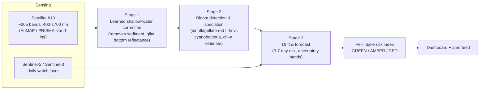

# MARSAD 813 — Hyperspectral Harmful-Algal-Bloom Early Warning

**An AI early-warning service that converts hyperspectral satellite spectra into bloom
alerts and 3–7 day risk forecasts for UAE desalination intakes and inland water
reserves — engineered for the shallow, turbid Gulf water where standard satellite
algorithms fail.**

Working name **MARSAD** (مَرصَد, Arabic for *watchpost / observatory*): a fixed
lookout that watches the water so operators do not learn about a bloom when cells
reach the intake screens. Built for the **Arab 813 Space Hackathon 2026** —
Theme 4 (Water Quality & Inland/Coastal Water Intelligence), Hyperspectral Data
Track (Satellite 813, 100+ bands).

## Why Gulf water breaks standard algorithms

The Arabian Gulf is the most desalination-dependent sea on Earth, and its water is
exactly where off-the-shelf satellite water-quality monitoring fails: it is shallow,
turbid, and hypersaline. Simple band-ratio chlorophyll algorithms tuned for open
ocean give garbage here because the algae pigment signal is mixed with sediment
backscatter, sunglint, and — in shallow coastal pixels — reflectance from the sea
bottom itself. Broad-band sensors cannot separate these effects, and they do not
sample diagnostic pigments such as phycocyanin (~620 nm, the toxic-cyanobacteria
marker) at all. The stakes are national: desalination provides most UAE potable
water, stored supply covers roughly a day or two of demand, the 2008–09
*Cochlodinium* bloom forced plant shutdowns, and losses during red-tide events run
over Dh368,000/day. Oman launched a bloom-prediction model in 2024; the UAE-side
gap is open. Solving that specific failure with a learned shallow-water correction
is the core of this project — not a generic bloom demo.

## Three-stage architecture



1. **Stage 1 — Shallow-water spectral correction (the novel core).** A learned
   correction that strips sunglint, sediment, and bottom-reflectance effects from
   coastal spectra. This is what makes everything downstream credible in Gulf water.
2. **Stage 2 — Bloom detection & speciation.** A spectral classifier over the band
   dimension separating no-bloom, dinoflagellate red tide (*Karenia*,
   *Cochlodinium*) near intakes, and toxic cyanobacteria (phycocyanin ~620 nm) in
   inland reservoirs — plus a chlorophyll-a intensity estimate.
3. **Stage 3 — Drift & forecast.** Fuses the daily Sentinel watch layer with sparse
   hyperspectral scenes to produce per-intake risk indices with 3–7 day lead time
   and explicit uncertainty bands. Honest architecture: 813's swath/revisit cannot
   monitor alone; fusion is the design, not a workaround.

Module-level APIs are frozen in [`docs/CONTRACTS.md`](docs/CONTRACTS.md).
The band grid (205 bands, 400–1700 nm) lives in
[`src/marsad/spectra.py`](src/marsad/spectra.py) — the single source of truth,
to be swapped for the real 813 band centres when GIQ publishes them.

## Quickstart

The virtual environment already exists at `.venv` (numpy, scikit-learn, pytest).
Do **not** create or activate anything — call its interpreter directly from the
repo root.

**PowerShell**

```powershell
.venv\Scripts\python.exe scripts\run_demo.py
# then open the dashboard:
Invoke-Item dashboard\index.html
```

**Git Bash**

```bash
".venv/Scripts/python" scripts/run_demo.py
# then open the dashboard:
start dashboard/index.html
```

`run_demo.py` trains the full pipeline on synthetic Gulf scenes, prints per-intake
risk and model metrics, and writes `outputs/results.json` +
`dashboard/data.js`. The dashboard is fully self-contained (works from `file://`,
no CDN). Run the tests with:

```bash
".venv/Scripts/python" -m pytest tests/ -q
```

## Repository layout

```
marsad-813/
├── README.md                  ← you are here
├── conftest.py                # pytest import-path setup
├── pyproject.toml
├── src/marsad/
│   ├── spectra.py             # 813 band grid + diagnostic wavelengths (source of truth)
│   ├── synth.py               # physics-based synthetic Gulf scene generator
│   ├── stage1_correction.py   # learned shallow-water correction (MLP autoencoder-style)
│   ├── stage2_classifier.py   # bloom detection, speciation, chl-a regression
│   ├── stage3_forecast.py     # damped-trend forecast with uncertainty bands
│   ├── risk.py                # per-intake GREEN/AMBER/RED policy
│   └── pipeline.py            # end-to-end orchestration, 4 UAE intakes/reservoirs
├── scripts/
│   ├── run_demo.py            # train + evaluate + write dashboard data
│   └── download_gloria.py     # documented stub for real GLORIA/PACE ingest
├── dashboard/
│   ├── index.html             # self-contained control-room dashboard
│   └── data.js                # generated by the pipeline
├── tests/                     # per-module fast, seeded tests
├── docs/
│   ├── CONTRACTS.md           # frozen module APIs
│   ├── ROADMAP.md             # PRD weeks → repo milestones
│   └── ACTION-CHECKLIST.md    # human-only hackathon actions & deadlines
├── data/                      # real datasets land here (empty in v0.1)
└── outputs/                   # results.json from pipeline runs
```

## Data plan

| Purpose | Source |
|---|---|
| Training (spectra→pigments) | GLORIA in-situ hyperspectral library (open, Nature Sci Data 2023) |
| Pretraining / global ocean color | NASA PACE OCI (free, hyperspectral, operational since 2024) |
| Regional hyperspectral scenes | 813 via GIQ (Phases 1–3), EnMAP, Tanager; PRISMA archive |
| Daily watch layer | Sentinel-2 MSI, Sentinel-3 OLCI (free) |
| Ground truth / events | MOCCAE red-tide monitoring records, published 2008–09 Gulf of Oman bloom studies, EAD coastal water-quality data, Oman SQU bloom literature |
| Validation | Hindcast on documented historical bloom events: show the model flags them days before reported impact |

## Current status — honest

**Today the models run end-to-end on physics-based synthetic Gulf spectra, not on
real satellite data.** `src/marsad/synth.py` generates scenes on the 205-band grid
encoding the known optics — chlorophyll absorption at 443/675 nm, the 555 nm green
peak, the 708 nm red-edge of dense blooms, the 620 nm phycocyanin dip, sediment
backscatter, sandy-bottom reflectance attenuated by depth, sunglint, and sensor
noise. That is enough to prove the architecture (Stage 1 measurably reduces
spectral RMSE; Stage 2 separates the three classes; Stage 3 produces bounded,
uncertainty-banded forecasts), and nothing more.

Remaining steps to real data, in order (see [`docs/ROADMAP.md`](docs/ROADMAP.md)):

1. Download GLORIA (~7,500 in-situ hyperspectral spectra with chlorophyll / TSS /
   phycocyanin; `scripts/download_gloria.py` documents the PANGAEA DOI) and
   resample it to the `spectra.BAND_GRID`; retrain Stage 2 on it.
2. Add NASA PACE OCI granules as pretraining / global ocean-color context.
3. Acquire EnMAP / PRISMA Gulf scenes and run Stage 1 on them using the same
   band-subset simulation of 813 (400–1,700 nm, ~205 bands); request first real
   813 scenes via GIQ.
4. Build the Sentinel-2/-3 daily watch-layer feed for Stage 3.
5. Assemble the historical bloom event list from MOCCAE records and published
   2008–09 *Cochlodinium* studies; hindcast-validate against it.
6. Swap the uniform band grid in `spectra.py` for the real 813 band centres once
   GIQ publishes them.

## Judging-criteria map

| Criterion | Our answer |
|---|---|
| Problem clarity | Named infrastructure, dated shutdown events, quantified buffer (1–2 days) |
| Technical robustness | Physics-informed correction + transfer learning + uncertainty quantification |
| EO/hyperspectral usage | 813-centric; hyperspectral is the enabling sensor (bonus points) |
| Innovation | First shallow-turbid-water HAB AI tuned to Gulf optics; speciation not just detection |
| Impact | National water security, SDG 6 & 14, scales to 22 Arab states |
| Commercial viability | Per-intake subscription; regional desal fleet is the market; MOCCAE/utility pilots |
